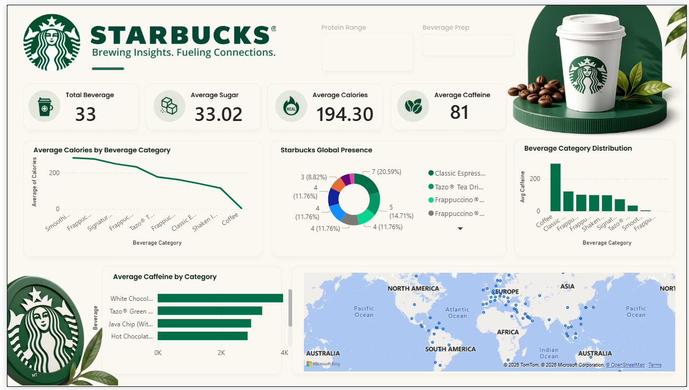

# ☕ Starbucks Beverage Analytics Dashboard | Power BI

## 📌 Project Overview

This Power BI dashboard provides an interactive analysis of Starbucks beverage products, helping users explore nutritional information, beverage categories, caffeine content, calorie distribution, and global Starbucks presence.

The dashboard transforms raw beverage data into meaningful business insights through interactive visualizations and KPI tracking.

---

## 🎯 Business Objective

The primary objective of this project is to:

* Analyze Starbucks beverage nutritional information.
* Identify high-calorie and high-caffeine beverages.
* Compare beverage categories based on nutritional metrics.
* Enable users to filter and explore beverage data interactively.
* Provide insights that can support healthier consumer choices and product analysis.

---

## 📊 Dashboard Features

### KPI Cards

The dashboard displays key performance indicators including:

* Total Beverages
* Average Sugar Content
* Average Calories
* Average Caffeine Content

### Interactive Filters

Users can dynamically filter data using:

* Protein Range
* Beverage Preparation Type

### Visualizations

#### 1. Average Calories by Beverage Category

Shows calorie trends across different beverage categories.

#### 2. Beverage Category Distribution

Displays the proportion of beverages in each category using a donut chart.

#### 3. Average Caffeine by Category

Compares caffeine content among beverage categories.

#### 4. Top 5 Highest Caffeine Beverages

Highlights beverages containing the highest caffeine levels.

#### 5. Starbucks Global Presence

Visual representation of Starbucks locations across countries using a map visualization.

---

## 🛠️ Tools & Technologies Used

* Power BI Desktop
* Power Query
* DAX (Data Analysis Expressions)
* Data Modeling
* Data Visualization
* Interactive Dashboard Design

---

## 📈 Key Metrics

The dashboard calculates:

* Total Beverage Count
* Average Sugar
* Average Calories
* Average Caffeine

Example DAX Measures:

```DAX
Total Beverages = COUNT(starbucks[Beverage])

Average Sugar = AVERAGE(starbucks[Sugars (g)])

Average Calories = AVERAGE(starbucks[Calories])

Average Caffeine = AVERAGE(starbucks[Caffeine (mg)])
```

---

## 🔍 Insights Generated

* Identify beverage categories with the highest calorie content.
* Discover beverages containing excessive caffeine.
* Compare nutritional values across product categories.
* Analyze category-wise beverage distribution.
* Explore Starbucks' global presence geographically.

---

## 📂 Dataset Information

The dataset contains information such as:

* Beverage Name
* Beverage Category
* Beverage Preparation
* Calories
* Sugar Content
* Protein Content
* Caffeine Content
* Country Information

---

## 🚀 Future Enhancements

* Add trend analysis over time.
* Include nutritional score calculation.
* Build drill-through pages for beverage details.
* Add mobile-optimized dashboard view.
* Implement advanced DAX measures for deeper insights.

---

## 📸 Dashboard Preview


---

## 👨‍💻 Author

**Uday Yadav**

Aspiring Data Analyst | Power BI Developer | SQL | Excel | Data Visualization

If you found this project useful, feel free to ⭐ the repository.
